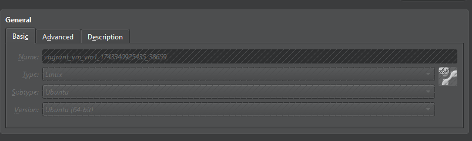
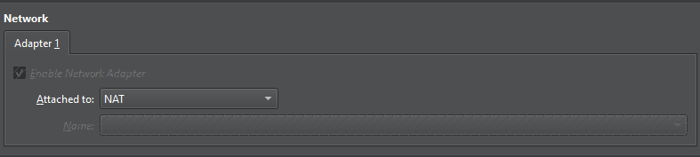
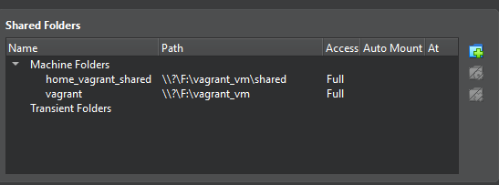
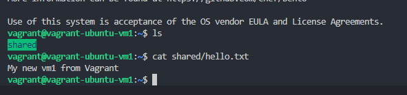
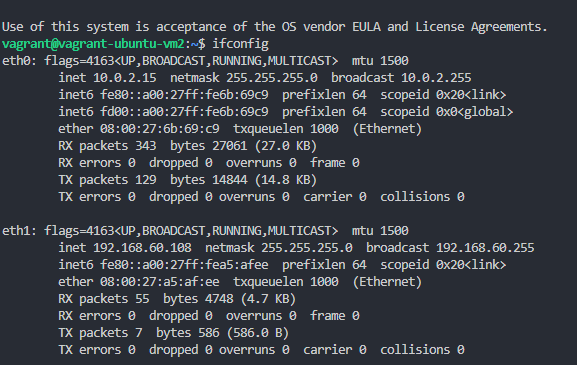
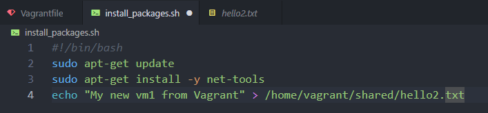
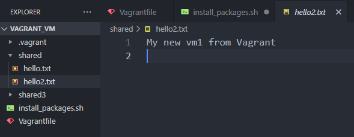
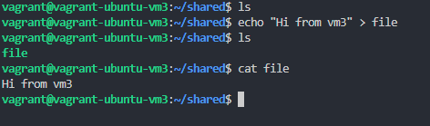
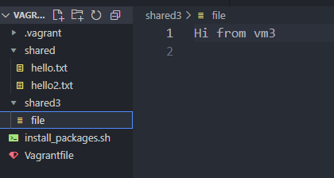

## Lecture 4 Vagrant

### Завдання: створити Vagrantfile, який запускає кілька віртуальних машин, із такими вимогами:

#### 1. VM1 (загальнодоступний вебсервер):
- Операційна система: на ваш вибір, особисто порекомендував би bento/ubuntu-24.04 або  generic/debian12
```ruby
config.vm.box = "bento/ubuntu-24.04"
```


- Мережеве під’єднання до загальнодоступної мережі з динамічним IP
```ruby
vm1.vm.network "public_network", type: "dhcp"
```


- Спільна папка між хостом і VM
```ruby
config.vm.synced_folder "./shared", "/home/vagrant/shared"
```


- Провізіонінг: використовуйте shell-команду для оновлення та інсталювання пакетів (на цьому  етапі — будь-яка проста команда, bash вивчатимемо в наступних лекціях)
```ruby
 vm1.vm.provision "shell", inline: <<-SHELL
        sudo apt update -y
        sudo apt install -y net-tools
        echo "My new vm1 from Vagrant" > /home/vagrant/shared/hello.txt
      SHELL
```



#### 2. VM2 (приватний сервер):
- Операційна система: на ваш вибір, особисто порекомендував би bento/ubuntu-24.04 або generic/debian12
**Однакова конфігурація для 1 та 2 машини**
- Під’єднання до приватної мережі зі статичним IP
```ruby
vm2.vm.network "private_network", type: "static", ip: "192.168.60.108"
```


- Спільна папка між хостом і VM
**Конфігурація для папки спільна з 1ю машинкою**
- Провізіонінг: використовуйте зовнішній bash-скрипт, який встановлює потрібні пакети  (на цьому етапі — будь-яка проста команда, bash вивчатимемо в наступних лекціях)
```ruby
vm2.vm.provision "shell", path: "install_packages.sh"
```
*Вміст конфігураційного файлу sh*

*При виконанні створився новий документ з текстом та встановились необхідні пакети*


#### VM3 (загальнодоступний сервер зі статичним IP):
- Операційна система: на ваш вибір, особисто порекомендував би bento/ubuntu-24.04 або generic/debian12
**Був обраний інший дистрибутив для конфігурування**
```ruby
vm3.vm.box = "generic/debian12"
vm3.vm.box_check_update = false
```
- Під’єднання до загальнодоступної мережі зі статичним IP — використовуйте мережевий  інтерфейс хоста для мостового під’єднання (наприклад, Wi-Fi)
```ruby
vm3.vm.network "public_network", bridge: "Wi-Fi", type: "static", ip: "192.168.60.118"
```
- Окрема спільна папка між хостом і VM
```ruby
vm3.vm.synced_folder "./shared3", "/home/vagrant/shared"
```
**тестування спільної папки**




### Vagrantfile config
``` ruby
Vagrant.configure("2") do |config|
  config.vm.box = "bento/ubuntu-24.04"
  config.vm.box_check_update = false
  config.vm.synced_folder "./shared", "/home/vagrant/shared"

  config.vm.define "vm1" do |vm1|
      vm1.vm.hostname = "vagrant-ubuntu-vm1"
      vm1.vm.network "public_network", type: "dhcp"
      vm1.vm.provision "shell", inline: <<-SHELL
        sudo apt update -y
        sudo apt install -y net-tools
        echo "My new vm1 from Vagrant" > /home/vagrant/shared/hello.txt
      SHELL
  end

  config.vm.define "vm2" do |vm2|
      vm2.vm.hostname = "vagrant-ubuntu-vm2"
      vm2.vm.network "private_network", type: "static", ip: "192.168.60.108"
      vm2.vm.provision "shell", path: "install_packages.sh"
  end

  config.vm.define "vm3" do |vm3|
    vm3.vm.box = "generic/debian12"
    vm3.vm.box_check_update = false
    vm3.vm.hostname = "vagrant-ubuntu-vm3"
    vm3.vm.network "public_network", bridge: "Wi-Fi", type: "static", ip: "192.168.60.118"
    vm3.vm.synced_folder "./shared3", "/home/vagrant/shared"
    vm3.vm.provision "shell", inline: <<-SHELL
        echo "My new vm3 from Vagrant" > /home/vagrant/shared/hello3.txt
      SHELL
  end
end
```


